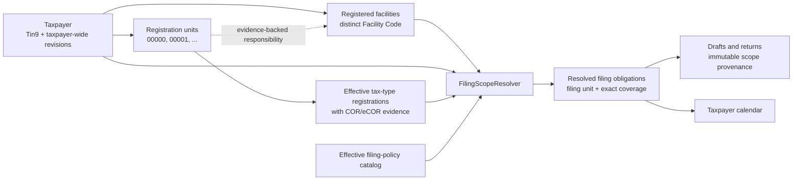

# TIN Root, Registration Units, and Filing Scope — Implementation Plan

**Status:** proposed architecture and dependency-ordered execution plan

**As of:** 2026-08-07

**Implementation state:** documentation only; no application code or schema has been changed

**Research companion:** [TIN, Branch Code, and Multi-Branch Filing Guide](TIN_BRANCH_PROFILE_AND_FILING_GUIDE_2026-08-07.md)
**Canonical vocabulary:** [BIR Taxpayer, Registration, and Filing Context](CONTEXT.md)

> **Portability note for `reverse-engineer-ebir-forms/bir`:** this plan was first audited against the Native/Zig application. Its `src/...` paths and UI/storage observations are historical evidence from that application, not paths or claims about this Rust/GPUI repository. Before implementation, remap each ownership boundary to this repository's `crates/bir-core`, `crates/bir-desktop`, form registry, Forms Set, calendar, migration, and draft-provenance code. Keep the regulatory conclusions and fail-closed **Review Required** behavior, but re-audit every code-level assumption here.

This plan translates the companion guide's official-source findings into a safe
change sequence for this repository. It is a product and software architecture
plan, not legal or tax advice. The taxpayer's effective BIR registration records
and the official rule applicable to the exact return revision and filing period
remain controlling.

For TIN-root, branch, facility, filing-unit, and return-coverage questions, this
document supersedes older profile-per-branch assumptions. It does not replace
the existing canonical field/projection contracts except where a future reviewed
milestone explicitly migrates their identity ownership. Historical UX and audit
documents remain evidence of prior behavior, not authority for filing scope.

If this plan conflicts with a current official issuance or form instruction,
the application must stop at **Review Required** until the policy record is
corrected and tested. A catalog entry or working screen is never evidence that a
taxpayer is legally required or permitted to file that form.

---

## Executive decision

The current branch implementation is not safe enough to extend with a simple
auto-increment button.

The target model is:

1. One `Taxpayer` owns one nine-digit `Tin9` root.
2. The taxpayer has one or more head-office/branch `RegistrationUnit` records;
   separately registered facilities are related records, not aliases for branches.
3. The head-office or principal registration unit uses branch code `00000`.
4. Each non-head-office unit records its BIR branch code separately.
   A BIR Facility Code remains a distinct identifier.
5. A new-branch flow may *suggest* the lowest unused code, such as `00001`, but
   the suggestion is not authoritative and cannot become filing-ready until it
   is confirmed against COR, eCOR, ORUS, or another reviewed BIR record.
6. Tax-type registrations are effective-dated facts of registration units, not
   form checkboxes.
7. A pure `FilingScopeResolver` decides the filing unit and exact coverage for a
   form revision and period.
8. A draft can be created only from a resolved filing obligation and must retain
   immutable taxpayer, filing-unit, source-unit coverage, registration, and
   policy provenance.

Therefore the base taxpayer profile must own `000-000-000`, not
`000-000-000-00000`. The first-taxpayer workflow should create the taxpayer and
its `00000` registration unit together. A branch is a child registration unit,
not another legal taxpayer profile.

This changes identity, persistence, migration, form availability, draft
provenance, calendars, and navigation. It is not an input-mask-only change.

---

## What the repository does today

The observations below are from `main` at
`8b2cd914e5ae3cd8009f0a6a3e2fff81f28d9d83`.

| Current behavior | Evidence | Consequence |
| --- | --- | --- |
| `Tin` stores a 9-digit root plus an optional 3–5 digit suffix as one value. | `src/tax_profile/field.zig:105-160` | Taxpayer identity and registration-unit identity are fused. |
| `ProfileRevision.identity.tin` owns that combined value. | `src/tax_profile/model.zig:64-67,251-264` | A branch-specific full TIN becomes a taxpayer-profile fact. |
| Evolution says one `ProfileId` is one legal taxpayer but anchors it with the combined TIN. | `src/tax_profile/evolution.zig:1-5,33-45` | Two branches of one taxpayer become two supposedly distinct legal identities. |
| New or changed profiles require 14 digits. | `src/tax_profile/ui_state.zig:1928-1935` | A base taxpayer cannot be entered as a root-only `Tin9`. |
| “Add branch” starts another profile, then requires the same root and legal-person kind. | `src/tax_profile/ui_state.zig:1653-1731,1985-2003` | The UI understands related registrations, but persistence still creates separate profile aggregates. |
| Branch creation does not allocate a code; tests manually enter `00002`. | `src/tax_profile/ui_state.zig:6286-6339` | There is no current incrementing policy, verified or otherwise. |
| Canonical-TIN uniqueness is checked on the complete stored value. | `src/tax_profile/store.zig:3603-3616,11959-11985` | It prevents duplicate full identifiers but not duplicate taxpayers with one shared root. |
| SQLite identity anchors accept 9, 12, 13, or 14 digits. | `src/tax_profile/store.zig:17226-17264` | Migration must preserve unresolved legacy suffix lengths; it must not silently pad them. |
| Forms Sets are keyed by `(profile_id, tax_year)`. | `src/tax_profile/store.zig:17009-17025` | Each branch profile can independently enable consolidated forms. |
| Form launch takes the selected `ProfileId` as filer. | `src/main.zig:14235-14261,14527-14623` | A branch row can launch a taxpayer-level or consolidated return with no scope decision. |
| Draft identity records `owner_profile_id`, form, year, and catalog hashes, but no filing unit or coverage. | `src/forms/draft_provenance.zig:165-184` | A saved draft cannot prove which branches it includes. |
| Exact draft streams store `filer_profile_id`. | `src/tax_profile/store.zig:17586-17617` | Existing immutable drafts need an explicit compatibility mapping. |
| Named-role distinctness compares `ProfileId` values. | `src/forms/compose.zig:53-120` | Two branch profiles of one natural taxpayer could incorrectly appear to be distinct people, including filer/spouse roles. |
| Taxpayer-year settings and Tax Form Profiles are also `ProfileId` scoped. | `src/tax_profile/taxpayer_year_settings.zig:78-93`; `src/tax_profile/tax_form_profile.zig:90-102` | Elections and annual setup can diverge across branches of one taxpayer. |
| The generated form catalog has category and cadence but no filing-scope policy. | `src/forms/generated/catalog.zig:74-89` | The app cannot distinguish consolidated, per-unit, inherited, transaction-specific, or review-required behavior. |
| There are 51 catalog forms: 10 editors and 41 calendar-only entries. | `src/forms/generated/catalog.zig:7370-7375` | Catalog presence must remain separate from editor capability and legal obligation. |
| Sidebar grouping by TIN root is presentation-only. | `src/main.zig:2170-2188,8514-8530` | Sorting does not create a taxpayer aggregate or enforce filing rules. |
| New entry is 3-3-3-5, while stored 3–5 digit suffixes remain visible without padding. | `src/components/segmented_tin.zig:1-13,99-113` | The migration needs an explicit unresolved-legacy state. |
| Exact 1701Q's filer branch mapping allows only three digits, although new profiles require five. | `src/form_engine/forms/form_1701q_2018/profile_mapping.zig:84-91,347-365`; `src/forms/form_1701q_exact_ui_state.zig:423-447` | A valid newly saved `...-00000` identity can fail editor opening; the official form/XML representation must be verified before changing geometry or mapping. |
| Taxpayer calendar availability first requires a catalog form and the selected profile's Forms Set. | `src/main.zig:11311-11324,11409-11430` | It cannot derive one consolidated obligation across units. |
| Calendar inventories disagree. Six rule codes are outside the 51-form catalog; three are also absent from the 54 global options. | `src/main.zig:342-358,391-399,8123-8136`; `src/calendar/domain.zig:482-531` | Some deadlines are impossible to select in a taxpayer calendar and some global events are filtered out. |

The README correctly limits current claims: other editors are UI/projection only,
submission and payment are UI only, and the app is not yet an authoritative
filing plan (`README.md:9-34`). This work must preserve that boundary.

---

## Target ownership model



### Aggregate boundaries

#### `TaxpayerRegistry`

Owns:

- `TaxpayerId`;
- one canonical `Tin9` root;
- taxpayer-wide, effective-dated legal identity revisions;
- registration units and their effective histories;
- separately registered facilities, facility types, and their effective histories;
- tax-type registrations;
- COR/eCOR/ORUS evidence references and review state;
- effective Large Taxpayers Service registration facts.

It does not decide which form must be filed.

#### `FilingPolicyCatalog`

Owns:

- exact form code and revision applicability;
- tax family and filing-scope policy;
- effective dates;
- LTS override, where an official rule establishes one;
- required special context;
- primary-source identifiers and reviewed policy version.

It does not load taxpayer data or create drafts.

#### `FilingScopeResolver`

Consumes immutable inputs and returns zero or more filing obligations or a
fail-closed review result. It performs no SQLite access and no UI work.

#### Draft preparation

Accepts a resolved obligation, form composition contract, and exact revision
snapshots. It must reject a bare selected profile or selected branch as
insufficient authority.

### Fact ownership

| Fact | Proposed owner | Notes |
| --- | --- | --- |
| Nine-digit TIN root | Taxpayer | Unique taxpayer identity anchor. |
| Legal-person class and registered legal name | Taxpayer revision | A branch does not create another legal person. Conflicts require migration review. |
| Head-office/branch code | Registration unit | `00000` is reserved for the principal/head-office unit. |
| Facility Code and facility type | Registered facility | Kept distinct from `BranchCode5`; link to a responsible unit only from evidence. |
| Unit status and effective period | Registration-unit revision | Opening, closure, transfer, and historical units must remain queryable. |
| RDO and registered address | Registration-unit revision | These can differ by unit and over time. |
| Trade name and line of business | Evidence-reviewed allocation | Some facts may be taxpayer-wide and others unit-specific; migrate only after their source contract is classified. |
| Tax type, ATC, and registration period | Tax-type registration | Must be tied to the unit and supporting evidence. |
| LTS registration/office | Effective taxpayer registration fact | Never infer it from EOPT size tier. |
| Income-tax regime and deduction election | Taxpayer-year settings | Branch count does not choose 1701 vs 1701A vs 1701-MS. |
| Transaction origin | Source unit on the transaction/fact | Consolidation must not rewrite origin to `00000`. |
| Filing identifier | Resolved obligation | Composes `Tin9` and the filing unit's `BranchCode5`. |
| Return coverage | Resolved obligation and immutable draft snapshot | Exact unit IDs, not a boolean `consolidated` flag. |

### Core invariants

1. A canonical `Tin9` belongs to at most one taxpayer.
2. A taxpayer has at most one effective `00000` unit at a time.
3. A branch code is unique among a taxpayer's effective registration units.
4. New confirmed codes have exactly five digits.
5. Legacy three- or four-digit suffixes are preserved as unresolved evidence;
   they are not silently left-padded.
6. A suggested branch code is provisional and cannot identify a filed return.
7. Correcting a TIN root and correcting a branch code are different audited
   operations.
8. A closed code is not automatically recycled without official evidence.
9. Named-role distinctness compares `TaxpayerId`, not a branch or legacy
   `ProfileId`.
10. A BIR Facility Code is never parsed or generated as a `BranchCode5` without
    an explicit official mapping.
11. Tax-type registrations and evidence are effective-dated and append-only.
12. Filing unit and source unit are distinct concepts.
13. Filing venue is distinct from filing scope and coverage.
14. A consolidated obligation contains an explicit, non-empty coverage set.
15. For one taxpayer, tax type, and period, resolved obligations cannot overlap
    coverage unless the policy explicitly models a legal overlap.
16. Draft creation requires a policy-backed obligation; selection state alone is
    never sufficient.
17. Existing immutable draft snapshots are not reinterpreted after migration.

---

## Identifier types and branch-code workflow

The implementation should introduce separate opaque domain types before
changing persistence or UI:

```zig
pub const TaxpayerId = OpaqueId(.taxpayer);
pub const RegistrationUnitId = OpaqueId(.registration_unit);
pub const RegisteredFacilityId = OpaqueId(.registered_facility);

pub const Tin9 = struct {
    digits: [9]u8,

    pub fn parse(raw: []const u8) TinError!Tin9;
    pub fn write(self: Tin9, output: []u8) error{NoSpaceLeft}![]const u8;
};

pub const BranchCode5 = struct {
    digits: [5]u8,

    pub fn parse(raw: []const u8) BranchCodeError!BranchCode5;
    pub fn isHeadOffice(self: BranchCode5) bool;
};

pub const UnitCodeState = union(enum) {
    proposed: BranchCode5,
    confirmed: struct {
        code: BranchCode5,
        evidence_id: RegistrationEvidenceId,
    },
    legacy_unresolved: OwnedLegacySuffix,
};
```

The displayed 14-digit filing identifier is a composition, not a stored second
taxpayer identity:

```text
TIN root:          000-000-000
Registration unit: 00000
Filing display:    000-000-000-00000
```

### First taxpayer

One transaction creates:

- a taxpayer with `Tin9`;
- a principal/head-office unit with the system-reserved code `00000`;
- an evidence-review task if registration evidence has not yet confirmed the
  unit's RDO, address, and tax registrations.

The user should not create a second “base profile” for the head office.

### Add branch

The app may calculate the lowest unused five-digit suggestion for convenience.
For example, if `00000` exists and no other units exist, it may display
`Suggested: 00001`.

The workflow must also say:

> Confirm this code from the branch's BIR registration record. The suggestion is
> not a BIR assignment.

The app must allow a different confirmed code, gaps, and a code already assigned
by BIR. It must reject a collision. A proposed unit may hold setup work, but it
must not generate filing obligations, appear as a confirmed invoice identity, or
create a filing draft.

---

## Filing-policy contract

Do not add `form.is_consolidated: bool`. Scope depends on the exact form
revision, period, effective registrations, LTS status, and sometimes a property,
instrument, facility, payee, employee, or parent return.

The policy vocabulary is:

```zig
pub const FilingScopePolicy = union(enum) {
    taxpayer_level,
    head_office_consolidated,
    registration_driven: RegistrationDrivenPolicy,
    transaction_specific: TransactionPolicyKind,
    administrative_registration,
    inherit_liability,
    source_recipient_document,
    inherit_parent: ParentArtifactKind,
    historical_only,
    review_required: ReviewReason,
};
```

Every current catalog code must have an explicit policy record. Unknown is not a
default; it is `review_required`.

### Keep capability separate from obligation

The existing generated catalog answers questions such as:

- Does a code exist in the product catalog?
- Is there an editor route or only a calendar entry?
- Which profile roles and fields can be projected?

The policy catalog answers different questions:

- Is this form revision applicable to this taxpayer and period?
- Which unit files it?
- Which units does it cover?
- Does LTS registration override the ordinary rule?
- What context or evidence is missing?

Implementation should add a reviewed policy source beside the TypeScript catalog
source, then generate Zig from it. Do not hand-edit
`src/forms/generated/catalog.zig`. A policy record should carry source IDs and an
effective interval, and the generator must reject any of the 51 codes without an
explicit classification.

### Resolver input and output

Illustrative Zig contract:

```zig
pub const ResolveInput = struct {
    form: FormRevisionKey,
    period: FilingPeriod,
    taxpayer: TaxpayerRegistrationSnapshot,
    policy: FilingPolicyRevision,
    special_context: ?SpecialFilingContext,
};

pub const FilingObligation = struct {
    taxpayer_id: TaxpayerId,
    form: FormRevisionKey,
    period: FilingPeriod,
    filing_unit_id: RegistrationUnitId,
    covered_unit_ids: []const RegistrationUnitId,
    registration_revision_ids: []const TaxTypeRegistrationRevisionId,
    policy_revision: FilingPolicyRevisionId,
    policy_evidence_ids: []const PolicyEvidenceId,
    resolution_hash: [32]u8,
};

pub const ResolveResult = union(enum) {
    obligations: []const FilingObligation,
    not_applicable,
    review_required: []const ResolutionIssue,
};

pub fn resolve(input: ResolveInput, arena: std.mem.Allocator) !ResolveResult;
```

The result is plural because a registration-driven rule can produce one return
per registered unit. The resolver must:

1. select the policy effective for the exact form revision and period;
2. load no state itself—its caller supplies a coherent as-of snapshot;
3. reject missing or contradictory registration evidence;
4. detect changes inside the period rather than choosing an arbitrary date;
5. apply a verified LTS override where applicable;
6. calculate the filing unit and exact source-unit coverage;
7. prove that coverage has no duplicate unit for the same obligation family;
8. return `Review Required` for facility-, property-, instrument-, or
   transaction-specific rules without the required context;
9. reject an incomplete or mixed registration pattern unless the effective
   policy explicitly defines its coverage;
10. hash the complete decision and evidence set for downstream provenance.

“All branches” must mean the exact set of applicable unit IDs selected from the
period snapshot, including a unit active for only part of the period when policy
requires it. It must not mean whatever branches exist when the draft is later
reopened.

### Scope, venue, and form representation are separate

The scope resolver answers **who files and what the return covers**. A separate,
effective-dated venue policy answers **where or through which channel filing and
payment may occur**. Current venue flexibility must not be interpreted as
permission to choose any branch as filer.

Exact form and submission adapters then answer **how the resolved identity is
represented** on that form revision. This separation is especially important
for the current 1701Q three-versus-five-digit control conflict: the taxpayer and
unit identity must remain lossless even when a historical paper or XML artifact
uses a different field shape.

---

## Draft and return provenance

The current `FilingIdentity` is not enough for multiple branches. Its successor
must snapshot at least:

- `TaxpayerId` and exact taxpayer revision;
- `Tin9` used by the draft;
- `RegistrationUnitId` and exact filing-unit revision;
- exact `BranchCode5` used on the return;
- all covered unit IDs and revisions in deterministic order;
- relevant tax-type registration revision IDs;
- form code, revision, and period;
- policy revision, primary-source evidence IDs, and resolution hash;
- LTS fact revision when it influenced scope;
- special context or parent-return identity;
- registered-facility identity and revision when a site rule affects the return;
- source-unit identity for every imported or entered reportable fact.

Reopening a draft shows the saved decision even when later registration facts
change. It may warn that the current resolver would now decide differently, but
it must not mutate the historical snapshot. An amended return creates a new
resolution and links to the prior return.

A consolidated return changes only the filing unit. It never rewrites a sale,
employee, payee, payment, credit, property, or instrument from its true source
unit to `00000`.

---

## UI and interaction design

### Navigation hierarchy

The primary selector becomes taxpayer-first:

```text
ACME CORPORATION                    123-456-789
  Head office                       00000  · RDO 047
  Cebu branch                       00001  · RDO 081
  Davao branch                      00004  · RDO 113
```

Indentation alone is insufficient. Rows need semantic labels, accessible state,
and a visible distinction between the taxpayer workspace and the current source
unit workspace.

### Taxpayer setup

Use separate sections:

1. **Taxpayer identity** — nine-digit TIN and taxpayer-wide facts.
2. **Registration units** — head office and branches.
3. **Registered facilities** — BIR facility code/type and evidence-backed
   relationship to a responsible office.
4. **Tax registrations** — effective tax types per unit.
5. **Registration evidence** — COR/eCOR/ORUS records and review state.
6. **Taxpayer-year settings** — elections and other period-specific facts.

### Form library states

Replace indiscriminate `Select all 51` behavior with policy-aware groups:

- **Required/eligible** — resolved from supported evidence;
- **Optional workflow** — legally optional and explicitly selected;
- **Covered by head office** — visible from a branch but cannot create a
  duplicate branch return;
- **Historical** — available only for supported historical periods;
- **Needs review** — blocked with an actionable missing-evidence reason;
- **Unsupported editor** — calendar/reference capability only.

Every card or form header should show:

- masked taxpayer TIN;
- current source-unit workspace;
- actual filing unit and branch code;
- resolved scope label;
- covered-unit count and expandable list;
- policy/evidence explanation;
- editor/fileability status separately.

### Behavior by scope

#### Head-office consolidated

From a branch workspace, the card remains visible but says, for example:

> Filed by Head office `00000`; covers Head office, Cebu, and Davao.

Opening it explicitly changes to filing context `00000` after showing the scope.
The branch tile becomes “Covered by head-office return,” not another actionable
return.

#### Per registered unit

The current confirmed unit remains the filing unit. The app lists the exact tax
registration and period that made the form applicable. Separate obligations must
partition source facts so the same transaction cannot be included twice.

#### Transaction-specific

The app asks for the property, instrument, transfer, facility, or other required
context. The currently selected branch is a convenience default only if the
policy explicitly permits it; otherwise no filing unit is assumed.

#### Review required

Launch is blocked. The screen explains the exact missing or contradictory fact,
such as:

- no confirmed `00000` unit;
- legacy short suffix not reconciled;
- missing effective tax registration;
- tax registration changes within the period;
- unknown LTS status where it changes the outcome;
- missing site or property jurisdiction;
- conflicting COR evidence.

### Draft switching

Switching taxpayer or unit with unsaved work must be blocked or explicitly
confirmed. Saved drafts always reopen with their immutable filing unit and
coverage, not the unit currently selected in navigation.

---

## Calendar and Forms Set redesign

The global dashboard can remain taxpayer-independent. The taxpayer calendar must
derive obligations from the same resolver used by form launch.

For example, one taxpayer with three units should get:

- one 1701Q/1702Q obligation under `00000` with three-unit coverage;
- one 2550Q obligation under `00000` with three-unit coverage;
- either one consolidated 2551Q or the exact per-registered-unit set, according
  to effective percentage-tax registrations and verified LTS status.

The stable calendar key should include taxpayer, form revision, period, filing
unit, and scope-policy revision. It must not be generated once per branch merely
because three old `ProfileId` rows exist.

The current Forms Set mixes user configuration with implied filing obligation.
Split it into:

1. evidence-backed registration and policy inputs;
2. resolver-produced obligations;
3. explicit optional workflow preferences;
4. product capability/editor availability.

Do not migrate old checkboxes directly into tax-type registrations. They are
useful migration evidence but not proof of what BIR registered.

Before rollout, reconcile the inventory drift among:

- 51 generated catalog codes;
- 54 global selector codes;
- 48 normalized calendar rule codes;
- the six current domain-only codes `1606`, `1621`, `2550DS`, `0611A`, `0613`,
  and `1707`;
- the `1604C`/`1604F` to `1604CF` normalization;
- `1701MS` versus `1701-MS` spelling;
- local legacy codes absent from the current official list, including
  `1601E`, `1601F`, `1602`, `1603`, generic `1702`, `1704`, and `2551M`;
- the severe `2200C` title conflict: the current official list describes
  cosmetic procedures, while the local catalog says coal and coke;
- local Form 2000 cadence `on_demand` versus the current official-list monthly
  description;
- the `0620` monthly and `1621` quarterly transition/effective-period gap.

Every code must have an explicit capability state and filing-policy state.
The `2200C` route stays blocked until its identity and source artifact are
corrected or proven.

---

## Persistence design

Add new append-only tables rather than rewriting identity anchors in place. The
exact names can follow repository conventions, but the logical records are:

```text
taxpayers
taxpayer_revisions
registration_units
registration_unit_revisions
registered_facilities
registered_facility_revisions
registration_evidence
tax_type_registrations
tax_type_registration_revisions
taxpayer_lts_revisions
filing_policy_revisions
legacy_profile_unit_mappings
resolved_filing_obligations
draft_filing_scope_snapshots
draft_coverage_units
draft_registration_bindings
```

Required database constraints include:

- unique canonical nine-digit TIN root;
- one durable `(taxpayer_id, branch_code)` assignment lineage; a code cannot be
  attached to a different unit merely because the first unit closed;
- at most one effective head-office unit;
- `00000` only for a head-office/principal unit;
- non-`00000` for a branch unit;
- Facility Code stored in a distinct facility domain and never constrained as a
  branch-code suffix;
- append-only revision rows;
- evidence and reviewer provenance for confirmed unit codes;
- deterministic coverage order and unique coverage members;
- foreign-key restriction from immutable drafts to exact revisions;
- no silent cascade deleting a taxpayer, registration unit, policy, or evidence
  referenced by a draft.

Use repository-style pure domain modules, explicit allocators, SQLite adapters,
and versioned migrations. Do not place filing rules in view handlers or SQL
queries.

---

## Legacy migration strategy

Migration must begin with a report, not a merge.

### Phase A — read-only inventory report

For every current profile, emit:

- old `ProfileId`;
- complete stored TIN and parsed root/suffix length;
- candidate taxpayer group by nine-digit root;
- legal-person class and registered/taxpayer names by revision;
- head-office/branch candidate;
- branch code, RDO, address, and effective history;
- facility codes/types and their evidence-backed office relationships;
- registration facts and COR evidence;
- Forms Sets and decision histories;
- coarse and exact draft references;
- candidate migration state and every blocking reason.

The report must be deterministic, contain no private field values beyond the
minimum needed for local review, and make no database writes.

### Phase B — classify groups

Safe candidates require:

- one shared root;
- compatible legal-person class and taxpayer-wide identity history;
- at most one confirmed head-office candidate per effective interval;
- no duplicate effective branch code;
- a reviewed mapping for every legacy suffix;
- no unexplained overlapping Forms Set or draft filing behavior.

RDO and address differences are expected unit differences. Legal name or
legal-person-class differences are taxpayer conflicts and must not be silently
merged.

A group containing branches but no verified `00000` profile remains blocked; the
migration must not manufacture a head office merely to satisfy the target shape.

### Phase C — create new records and compatibility mappings

Create distinct `TaxpayerId` and `RegistrationUnitId` values, then record an
immutable mapping:

```text
old ProfileId -> TaxpayerId + RegistrationUnitId + migration decision
```

Do not reuse the old full-TIN identity anchor as the new taxpayer key. Keep old
tables readable during the compatibility period.

### Phase D — preserve drafts

Existing drafts remain byte-for-byte and revision-for-revision historical
records. Link their old `ProfileId` through the migration map, but do not claim a
coverage set that was never stored. Mark such scope provenance as
`legacy_unknown` or `review_required`.

A prior branch-coded income-tax or VAT draft is a filing-safety finding. It is
not automatically reassigned to `00000`.

### Phase E — Forms Set disposition

Old per-profile selections become migration evidence only. The migration report
may propose:

- product-capability preference;
- optional workflow preference;
- candidate tax-type registration needing COR confirmation;
- unsafe consolidated-form selection on a branch;
- obsolete or historical form selection.

It must never convert “enabled” directly into “legally registered.”

### Phase F — cutover and rollback

Use a feature flag or schema capability check so the old read path remains
available until:

- counts and mappings reconcile;
- all non-conflicting groups pass invariant checks;
- resolver results match reviewed fixtures;
- drafts reopen with unchanged historical provenance;
- UI and calendar tests pass;
- a backup and rollback rehearsal have succeeded on a disposable database copy.

The migration must be idempotent. A second dry run and a second completed run
must not create new IDs or different decisions.

### Mandatory migration stop conditions

Stop a taxpayer group and request review when any of these occurs:

- two different legal people share a parsed root;
- subject kind or legal-person class conflicts;
- no unique head-office candidate exists;
- only branch candidates exist and no evidence establishes the head office;
- multiple effective `00000` candidates exist;
- branch codes collide or are absent;
- a 3- or 4-digit legacy suffix has no verified representation;
- a stored Facility Code has been conflated with a branch suffix;
- effective histories overlap inconsistently;
- COR/eCOR and stored data disagree;
- a governing issuance's exact effectivity for the filing period is unverified;
- tax registration changes inside a filing period;
- LTS status is unknown and would change the result;
- a branch-coded draft exists for a normally consolidated family;
- old immutable draft references cannot be preserved;
- complete, non-duplicate return coverage cannot be proven.

---

## Rejected designs

### Keep one profile per branch and add `parent_profile_id`

Rejected. It leaves taxpayer-wide revisions duplicated, keeps Forms Sets and
draft identity attached to the wrong aggregate, and makes every form path
responsible for remembering whether to climb to a parent. The current failure is
an ownership failure, not merely a missing parent pointer.

### Store a list of branches inside one profile revision

Rejected. Units need independent effective histories, RDO/address facts, tax
registrations, evidence, closure state, and queryable draft references. A single
large profile revision would force unrelated branch changes to rewrite the whole
taxpayer aggregate.

### Add `is_consolidated` to each form

Rejected. Percentage tax, withholding, periodic DST, excise, transaction forms,
attachments, historical revisions, and LTS overrides demonstrate that scope is a
resolved policy, not a static property.

### Let the selected branch decide the filer

Rejected. Selection is a workspace convenience. It cannot override a mandatory
head-office filing rule or establish property/site jurisdiction.

### Automatically assign `00001`, `00002`, and so on as official codes

Rejected. The UI may suggest the lowest unused value, but only reviewed BIR
registration evidence can confirm the code. Existing taxpayers can have gaps,
closed branches, migrated numbering, or codes already assigned outside the app.

### Silently pad legacy suffixes to five digits

Rejected. The current component deliberately preserves legacy values without
manufacturing zeroes. Any normalization must be backed by exact official/form
revision evidence and an auditable migration decision.

---

## Dependency-ordered implementation plan

No later milestone may begin its write path until the preceding milestone's exit
gate passes.

The first representative fixture should be one taxpayer with `00000` plus one
confirmed branch. Use 1701Q to exercise head-office-consolidated scope and 2551Q
to exercise both consolidated and per-registered-unit outcomes. This fixture may
test the resolver, calendar, and provenance before the exact 1701Q editor is
enabled; that editor remains blocked by its unresolved three-versus-five-digit
artifact mapping.

### Milestone 0 — policy evidence matrix and contract fixtures

Deliver:

- reviewed source register and 51-code filing-policy matrix;
- verified effectivity intervals or an explicit Review Required result where an
  issuance's publication/effectivity date is unresolved;
- adjacent form/attachment inventory;
- confidence and open-gap classification;
- executable policy fixtures for the directly supported rule families;
- an explicit `ReviewRequired` fixture for every unverified family.

Include at minimum:

- income tax and VAT head-office consolidation;
- percentage-tax and withholding registration-driven alternatives;
- verified LTS overrides;
- periodic DST distinction;
- excise/site, ONETT/property, transfer-tax, and special-form review states;
- parent-scope inheritance for attachments.

**Exit gate:** every one of the 51 catalog codes has an explicit, sourced policy
or `ReviewRequired`; no source claim relies only on the supplied ChatGPT text.

### Milestone 1 — identifier and registry domain types

Deliver:

- `Tin9`, `BranchCode5`, `TaxpayerId`, and `RegistrationUnitId`;
- `RegisteredFacilityId` and a distinct, evidence-preserving Facility Code type;
- head-office and unit-code invariants;
- provisional/confirmed/legacy-unresolved code states;
- taxpayer and unit revision types;
- formatting adapters that compose 14-digit display identifiers without
  restoring a combined identity anchor.

**Exit gate:** pure unit tests cover valid/invalid roots and codes, uniqueness,
`00000`, suggestion without confirmation, and legacy non-padding.

### Milestone 2 — registry persistence and evidence

Deliver:

- versioned append-only taxpayer/unit tables;
- registered-facility tables that do not reuse branch-code constraints;
- effective tax-type registration tables;
- COR/eCOR/ORUS evidence references and review states;
- explicit effective LTS registration facts;
- repository adapters and invariant enforcement.

**Exit gate:** persistence tests prove revisions, effective-date lookup, code
collision prevention, and foreign-key preservation.

### Milestone 3 — migration report before mutation

Deliver:

- deterministic read-only legacy profile grouping report;
- conflict classifications and human-review format;
- fixtures for one taxpayer with head office and multiple branches;
- fixtures for duplicate roots, names, classes, suffix lengths, missing head
  office, and old drafts.

**Exit gate:** report runs twice with identical output and zero database writes.
No data migration is authorized by this milestone.

### Milestone 4 — filing-policy catalog

Deliver:

- effective-dated, evidence-linked policy source;
- generated Zig representation;
- build-time 51-code coverage check;
- normalized code aliases without losing official display codes;
- separate capability and policy queries.

**Exit gate:** generator fails on an unclassified code, stale evidence ID,
overlapping policy interval, or unsupported silent default.

### Milestone 5 — pure filing-scope resolver

Deliver:

- resolver and resolution issue vocabulary;
- exact filing-unit and coverage output;
- registration-driven plural obligations;
- LTS override processing;
- parent and transaction context paths;
- coverage-partition checks and resolution hash.

**Exit gate:** exhaustive matrix tests pass, including mid-period changes,
missing evidence, duplicate coverage, and special-context failures.

### Milestone 6 — draft provenance and launch guard

Deliver:

- immutable filing-scope snapshot tables;
- draft creation from `FilingObligation` only;
- stale/direct UI action re-resolution;
- compatibility mapping for old profile-based drafts;
- reopen/amendment behavior;
- exact 1701Q five-digit representation research and regression test.

**Exit gate:** no editor route can open a new draft from only a selected
`ProfileId`; old drafts reopen unchanged; five-digit 1701Q behavior is proven
against the exact official form/XML artifact or fails closed.

### Milestone 7 — Forms Set and taxpayer calendar projection

Deliver:

- obligation-based taxpayer calendar;
- one consolidated deadline rather than one per branch;
- per-unit deadlines only when policy resolves them;
- separation of registrations, optional preferences, and editor capability;
- reconciliation of catalog/global/calendar code drift.

**Exit gate:** form launch, calendar cards, and export consume the same resolved
obligation identity and coverage.

### Milestone 8 — taxpayer and registration-unit UI

Deliver:

- taxpayer-first navigation;
- separate taxpayer/unit/evidence/tax-registration editors;
- add-branch suggestion plus evidence confirmation;
- scope banner and covered-unit detail;
- Review Required repair flows;
- dirty-draft switching guards;
- accessible keyboard, screen-reader, focus, and responsive states.

Edit Native source fragments, not generated `src/app.native`, then regenerate.

**Exit gate:** representative desktop and phone flows pass visual and interaction
tests before broad page conversion.

### Milestone 9 — form-family integration in risk order

1. **Income tax and VAT:** mandatory head-office-consolidated identity and
   coverage. This establishes the safest vertical slice.
2. **Percentage tax and withholding:** effective registration-driven scope and
   LTS override.
3. **Annual information returns, certificates, and attachments:** inherit and
   validate parent/period scope.
4. **Payment forms:** inherit the underlying assessed/return liability. Never
   generate a recurring branch Form 0605 annual registration-fee obligation
   after the fee's 2024 repeal.
5. **ONETT, capital gains, donor, and estate flows:** dedicated transaction and
   jurisdiction context.
6. **Periodic DST:** registration-driven only where exact evidence is complete.
7. **Excise and specialist site/product forms:** remain Review Required until
   premises, product, removal, and registration rules are modeled.

**Exit gate per family:** sourced policy fixtures, resolver tests, persistence
provenance tests, UI scope tests, calendar tests, and exact form mapping tests all
pass. One family passing does not certify another.

### Milestone 10 — reviewed data migration and compatibility cutover

Deliver:

- approved mapping decisions from the dry-run report;
- idempotent migration on disposable database copies;
- old-to-new ID mappings;
- unchanged historical drafts;
- rollback rehearsal and migration audit report;
- feature-flagged cutover.

**Exit gate:** every migrated record reconciles, every blocked group remains
untouched and visible for review, and no draft or filing identity is silently
rewritten.

### Milestone 11 — fileability and release gates

This architecture can make identity and scope safer, but it does not by itself
make a form fileable or the app production-ready.

Keep separate gates for:

- editor/computation completeness;
- official PDF/XML/schema parity;
- validation and attachment completeness;
- submission authorization and transport;
- payment/status/retry behavior;
- signed distribution and production operations.

**Exit gate:** only the exact form revisions that pass all applicable gates may
be called fileable. The repository-wide README warning remains until the whole
product claim is independently justified.

---

## Acceptance test matrix

### Identity and unit registration

- Creating a taxpayer accepts a nine-digit TIN root and creates one `00000` unit.
- A second effective `00000` unit is rejected.
- Add branch suggests the lowest unused code but labels it provisional.
- A confirmed code must cite reviewed registration evidence.
- A gap such as `00001` then `00004` is accepted when evidence supports it.
- A duplicate effective code is rejected.
- A legacy 3- or 4-digit suffix remains unresolved and cannot file.
- A Facility Code remains distinct and cannot satisfy a branch-code requirement
  by accident.
- A different legal person with another TIN is never added as a branch.
- Two registration units of one natural person cannot satisfy a filer/spouse
  distinct-person rule.

### Filing scope

- Three-unit income-tax taxpayer resolves one `00000` obligation with exact
  three-unit coverage.
- Three-unit VAT taxpayer resolves one `00000` obligation.
- Head-office-only percentage-tax registration resolves one consolidated 2551Q.
- Separate percentage-tax registrations resolve the exact per-unit 2551Q set.
- Verified LTS status produces the sourced mandatory consolidation override.
- Withholding monthly, quarterly, annual, certificate, and alphalist scopes stay
  consistent.
- Periodic DST follows its verified registration policy; excise without site
  context returns Review Required.
- A real-property or instrument form never inherits the selected branch without
  transaction context.
- A change in permitted filing/payment venue does not change filing unit or
  return coverage.
- An attachment exactly inherits its parent return's coverage.
- A mid-period registration change returns Review Required unless an explicit
  effective policy models the split.
- No source unit occurs in two obligations for the same tax family and period.

### Drafts

- Draft creation without a resolved obligation fails.
- Draft identity contains filing unit, coverage, registrations, policy, and
  evidence.
- Reopening after a branch closes retains the saved historical scope.
- Amendment creates a new resolution and preserves its predecessor.
- Direct/stale UI actions rerun the resolver.
- Exact 1701Q does not discard or truncate a five-digit branch code.

### Calendar and UI

- Consolidated forms create one taxpayer-calendar card, not one per unit.
- Per-unit forms display distinct filing units without overlapping coverage.
- A branch workspace labels consolidated forms as covered by head office.
- Scope, filing unit, current source unit, and coverage remain visible in the
  editor header.
- Review Required explains the precise missing evidence and blocks launch.
- Dirty draft switching is guarded.
- All 51 catalog codes and all domain calendar codes have explicit capability
  and policy disposition.

### Migration

- A fixture with old `...00000`, `...00001`, and `...00004` profiles maps to one
  taxpayer and three units only after review.
- Conflicting names or legal-person classes do not merge.
- RDO/address differences map to unit revisions rather than taxpayer conflicts.
- Legacy suffixes do not pad silently.
- Old Forms Sets are not promoted to tax registrations.
- Old drafts remain immutable and are marked `legacy_unknown` where coverage was
  not recorded.
- Dry-run and migration output are deterministic and idempotent.

---

## Verification commands for future implementation

Run from the implementation worktree after editing source files:

```sh
rtk npm run generate
rtk npm run check:tax-catalog
rtk just check
rtk just test
rtk just build
rtk git diff --check
```

For UI changes, rebuild and relaunch before trusting automation or screenshots.
Inspect both desktop and phone representative states. Generated files must match
their source fragments, and the final diff must not contain direct edits that
the generator overwrites.

For migration work, add and run a read-only report against a disposable copy
before any mutating command. Never test a migration against the user's only
profile database.

---

## Definition of done for this initiative

This initiative is complete only when:

- the nine-digit taxpayer identity and five-digit registration-unit code are
  separate in domain and persistence;
- every current form code has an effective, evidence-linked scope policy or
  explicit Review Required state;
- all draft and calendar creation uses one resolver;
- return coverage is immutable and auditable;
- branch suggestions cannot masquerade as BIR-assigned codes;
- legacy data is migrated only through reviewed, reversible decisions;
- the exact 1701Q three-versus-five-digit conflict is resolved from official
  artifact evidence;
- all acceptance and repository verification gates pass;
- fileability and production-readiness claims remain separately gated.

Until then, the safe product behavior is to block ambiguous filing scope rather
than select the active branch or assume consolidation.
