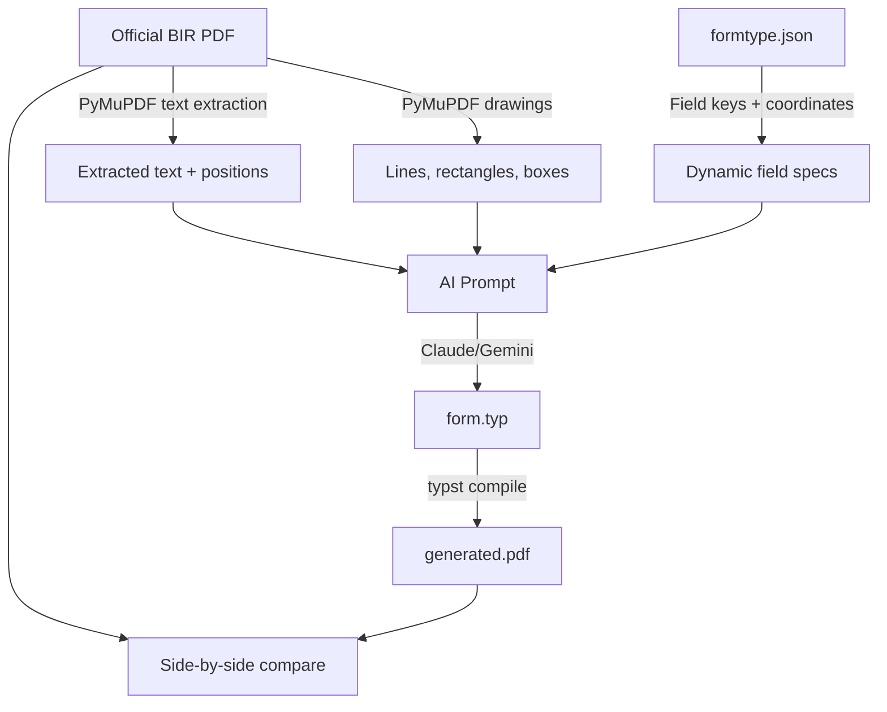

# Typst-Native Hybrid Form Strategy

> **Goal**: Replace fragile SVG-from-PDF backgrounds with **Typst-authored form templates** that are version-controlled, programmable, and pixel-perfect — while using the existing Layout Editor as a side-by-side calibration tool.

---

## Current Architecture (How It Works Today)

```
Official BIR PDF (from Windows binary)
        │
        ├──→ generate_formtype.py  ──→ pages/*.svg (raster backgrounds)
        │                          ──→ formtype.json (field coordinates)
        │
        ├──→ form-generator skill  ──→ form_*.rs (Rust draft struct + XML map)
        │
        └──→ bir-print crate
               │
               ├── generate_typst() ──→ generated.typ
               │     • Embeds SVGs as page backgrounds
               │     • Overlays field values using template.typ macros
               │
               └── typst compile ──→ generated.pdf
```

### Key Pain Points

| Problem | Impact |
|---------|--------|
| **SVG backgrounds are raster snapshots** | If BIR updates the PDF, we must re-extract SVGs and re-calibrate all ~50+ field coordinates |
| **Field positions are fragile** | Coordinates are hand-nudged in JSON; any PDF revision invalidates them |
| **No version control of form layout** | SVGs are binary blobs; diffs are meaningless |
| **Template is just helper macros** | `template.typ` only defines `put()`, `label()`, `cells()`, `mark()`, `amount()` — it doesn't draw the form |
| **Can't add/modify form structure** | To change a field label, section header, or layout, we'd need to regenerate from the BIR PDF |

---

## Proposed Architecture (Typst-Native Hybrid)

```
Official BIR PDF (reference only)
        │
        │   ┌──────────────────────────────────────────┐
        │   │  AI + Layout Editor (one-time bootstrap)  │
        │   │                                          │
        │   │  1. AI reads PDF → generates form.typ    │
        │   │  2. form.typ draws the ENTIRE form:      │
        │   │     • Static: headers, lines, labels     │
        │   │     • Dynamic: field placeholders         │
        │   │  3. Layout Editor: side-by-side compare  │
        │   │     • Left: SVG from official PDF         │
        │   │     • Right: Preview from form.typ        │
        │   │  4. Human nudges coordinates until match  │
        │   └──────────────────────────┬───────────────┘
                                       │
                                       ▼
                    formtypes/{form_id}/
                    ├── form.typ          ← NEW: Typst-authored form template
                    ├── template.typ      ← Shared macros (put, label, cells, etc.)
                    ├── formtype.json     ← Layout Editor coordinate nudging only
                    └── pages/*.svg       ← KEPT as reference for comparison

At render time:
     form.typ + data.json ──→ typst compile ──→ final.pdf
```

### What Changes

| Aspect | Before | After |
|--------|--------|-------|
| **Background** | SVG raster from official PDF | Typst draws the form from code |
| **Field positions** | JSON coordinates + template macros | Typst-native coordinates in `form.typ` |
| **Maintenance** | Re-extract SVGs on any BIR update | Edit `form.typ` text; git diff shows exactly what changed |
| **Programmability** | None — SVGs are static | Full Typst scripting: loops for schedule rows, conditionals, computed fields |
| **Ownership** | BIR controls the visual; we just overlay | We control the entire visual output |

---

## Phase 1: Typst Form Template Generator (AI Skill)

### Objective

Create/update the `form-generator` skill to produce a `form.typ` file that draws the **complete form** — all static text, lines, boxes, headers, and dynamic field placeholders.

### How AI Generates `form.typ`



### AI Prompt Strategy

The AI receives:
1. **Extracted text** (positions + content) from PyMuPDF
2. **Vector drawing data** (lines, rectangles) from PyMuPDF
3. **Field definitions** from `formtype.json` (keys, types, coordinates)
4. **Template macros** from `template.typ`

And produces a complete `form.typ` that:
- Uses `#set page(width: Wpt, height: Hpt, margin: 0pt)` for exact page sizing
- Draws static elements (headers, section dividers, labels) using `place()` + `text()`
- Draws dynamic fields using the existing `label()`, `cells()`, `mark()`, `amount()` macros
- Loads field data from `#let data = json("data.json")`

### New Script: `extract_form_structure.py`

```python
# Extracts ALL visual elements from a BIR PDF for AI consumption:
# - Text blocks: content, position, font size, font weight
# - Lines: start, end, thickness
# - Rectangles: bounds, fill, stroke
# - Page dimensions
# Output: form_structure.json (machine-readable for AI prompt)
```

### Updated form-generator Skill

Add a new phase to the existing skill:

```
Phase 1: Parse savefile → Rust code (existing)
Phase 2: Extract PDF structure → form_structure.json (NEW)
Phase 3: AI generates form.typ from structure + fields (NEW)
```

---

## Phase 2: Side-by-Side Layout Editor

### Objective

Extend the `PdfLayoutEditorView` to show the official SVG alongside the Typst-rendered preview for pixel-perfect comparison.

### Layout

```
┌────────────────────────────────────────────────────────────┐
│  2551Qv2018          Page: < 1/2 >   View  Edit   Save    │
├─────────────────────────┬──────────────────────────────────┤
│                         │                                  │
│   OFFICIAL (SVG)        │   TYPST PREVIEW (PNG)            │
│                         │                                  │
│   Rendered from         │   Rendered from                  │
│   pages/page1.svg       │   form.typ → preview.png         │
│                         │                                  │
│   Shows field boxes     │   Shows actual Typst output      │
│   from formtype.json    │   with sample data               │
│                         │                                  │
├─────────────────────────┴──────────────────────────────────┤
│  Sidebar: Field list + coordinate nudge controls           │
└────────────────────────────────────────────────────────────┘
```

### Key Features

1. **Split view** — Left pane shows SVG background with field overlays (current behavior). Right pane shows Typst-compiled preview PNG.
2. **Sync zoom/pan** — Both panes zoom and pan together for direct pixel comparison.
3. **Live reload** — When `form.typ` is saved, the right pane recompiles and refreshes.
4. **Overlay mode** — Optional toggle to superimpose both views with adjustable opacity for precise alignment checking.
5. **Diff highlights** — Areas where the two images diverge could be highlighted (future enhancement).

### Implementation

- Use `typst compile --format png --ppi 144` to generate preview PNGs
- Watch `form.typ` for changes (already have `notify` dependency)
- Add a `SplitView` mode toggle to the navbar

---

## Phase 3: Data-Driven Rendering Pipeline

### Updated `bir-print` Flow

```rust
pub fn render_flat_pdf(request: PrintRequest) -> Result<PrintResult, PrintError> {
    // 1. Try Typst-native form first
    if let Ok(form_typ) = load_form_typ(&request.form_id, formtypes_dir) {
        // New path: form.typ draws everything (background + fields)
        let data_json = serde_json::to_string_pretty(&request.fields)?;
        fs::write(output_dir.join("data.json"), &data_json)?;
        // form.typ reads: #let data = json("data.json")
        let typ_path = output_dir.join("form.typ");
        fs::write(&typ_path, form_typ)?;
        compile_typst(&typ_path, &pdf_path, &output_dir)?;
        return Ok(result);
    }

    // 2. Fallback: legacy SVG-background path (current behavior)
    let formtype = load_formtype_resolved(...)?;
    let template = load_template_resolved(...)?;
    let typst = generate_typst(&formtype, &request.fields, &template)?;
    // ... existing code
}
```

### `form.typ` Structure

```typst
// form.typ — Complete BIR Form 2551Q (Typst-native)
#set page(width: 612pt, height: 936pt, margin: 0pt)
#import "template.typ": put, label, cells, mark, amount

#let data = json("data.json")

// ── Page 1 ──────────────────────────────────────────────
#page(foreground: {

  // ══ Static: Form Header ══
  put(160, 68, text(font: "Arial", size: 7pt, "Republic of the Philippines"))
  put(160, 78, text(font: "Arial", size: 7pt, weight: "bold", "Department of Finance"))
  put(160, 88, text(font: "Arial", size: 7pt, weight: "bold", "Bureau of Internal Revenue"))

  put(33, 94, text(font: "Arial", size: 7pt, "BIR Form No."))
  put(33, 104, text(font: "Arial", size: 24pt, weight: "bold", "2551Q"))
  put(33, 138, text(font: "Arial", size: 6.5pt, "January 2018 (ENCS)"))
  put(200, 100, text(font: "Arial", size: 14pt, weight: "bold", "Quarterly Percentage Tax Return"))

  // ══ Static: Lines & Boxes ══
  // Horizontal rule under header
  put(0, 160, line(length: 612pt, stroke: 0.5pt))
  // ... more lines

  // ══ Dynamic: Field values ══
  // TIN (cells)
  cells(220, 164, 14.1, data.at("frm2551Qv2018:txtTIN1", default: ""))
  cells(284, 164, 14.1, data.at("frm2551Qv2018:txtTIN2", default: ""))
  // Taxpayer name (text)
  label(33, 186, 8.5, data.at("frm2551Qv2018:registeredName", default: ""))
  // Checkboxes
  if data.at("frm2551Qv2018:forThe_1", default: "") in ("1", "true") { mark(87, 108) }
  // Amount fields
  amount(384, 376, 14, 11, 553, data.at("frm2551Qv2018:txt14", default: "0.00"))

})[]
```

---

## Phase 4: Skill & Tooling Updates

### Updated Skill: `form-generator`

| Phase | Current | New |
|-------|---------|-----|
| Parse savefile → field analysis | ✅ Exists | No change |
| Generate Rust code | ✅ Exists | No change |
| Extract PDF structure | ❌ Missing | **NEW**: `extract_form_structure.py` |
| Generate `form.typ` from structure | ❌ Missing | **NEW**: AI-assisted Typst generation |
| Validate `form.typ` output | ❌ Missing | **NEW**: Side-by-side comparison protocol |

### New Script: `extract_form_structure.py`

```python
"""
Extract all visual elements from a BIR PDF for Typst form generation.

Output: form_structure.json containing:
- text_blocks: [{content, x, y, font_size, font_name, is_bold, page}, ...]
- lines: [{x1, y1, x2, y2, width, page}, ...]
- rectangles: [{x, y, w, h, fill, stroke, page}, ...]
- page_dimensions: {width, height, count}
"""
```

### New justfile Recipe

```makefile
# Bootstrap a Typst-native form from an official PDF
typst-form PDF FORM_ID TITLE:
    python3 .scripts/extract_form_structure.py --input {{PDF}} --form-id {{FORM_ID}}
    @echo "Structure extracted. Ask AI to generate form.typ from formtypes/{{FORM_ID}}/form_structure.json"
```

---

## Migration Strategy

### Dual-Path Rendering (Backward Compatible)

```
formtypes/{form_id}/
├── form.typ          ← NEW: If present, used as primary renderer
├── template.typ      ← Shared macros (used by both paths)
├── formtype.json     ← Layout Editor coordinate nudging only
├── pages/*.svg       ← Used by: legacy SVG path + Layout Editor comparison
└── form_structure.json ← NEW: AI-readable form structure (dev-time only)
```

**Rendering priority:**
1. If `form.typ` exists → Typst-native path (new)
2. Else → SVG-background path (existing, no changes)

This means every form continues to work exactly as before. Typst-native forms are opt-in per form.

> **Note:** AcroForm (editable PDF) is not needed. The PDF is a read-only output with all fields pre-filled by the application. Users view it; they don't edit it.

### Visual Calibration (Onion Skinning)

To achieve the "pixel-perfect" clone required, we will build a dedicated **Typst Calibration Tool** (`TypstCalibrationView`). This is separate from the `PdfLayoutEditorView` to avoid muddying the original Layout Engine coordinate mapping logic.

**Features of the Calibration View:**
- **Stacked View (Onion Skinning)**: The official PDF snapshot (`pages/page1.svg`) and the Typst PNG output (`preview.png`) are stacked on top of each other.
- **Opacity Toggle**: Developers can toggle opacity or invert colors to visually diff the two layers. Perfect overlaps will blend; 1px mistakes will vividly stand out.
- **Independent Controls**: The Typst layer and PDF layer can be moved independently to perfectly align them if the background SVGs aren't intrinsically mapped to exactly `0,0`.
- **Hot-Reloading**: Modifying `form.typ` in your text editor (VSCode/Zed) will instantly trigger a `typst compile --format png` background job and hot-reload the overlay PNG in the GPUI window, providing instant visual feedback without recompiling the Rust desktop app.

### Per-Form Migration Checklist

- [ ] Run `extract_form_structure.py` on the official PDF
- [ ] AI generates initial `form.typ` from `form_structure.json`
- [ ] Use Layout Editor side-by-side mode to compare
- [ ] Human nudges coordinates in `form.typ` until pixel-perfect
- [ ] Switch `bir-print` to use `form.typ` for that form
- [ ] Keep `pages/*.svg` as reference (don't delete)

---

## Resolved Decisions

| # | Question | Decision |
|---|----------|----------|
| 1 | **Static Element Fidelity** | ✅ **Pixel-perfect clone** — every line, font weight, and spacing must match the official PDF exactly |
| 2 | **formtype.json Retention** | `formtype.json` is retained for Layout Editor coordinate nudging only. `form.typ` embeds field positions directly. |
| 3 | **AcroForm Support** | ❌ **Not needed.** PDF is read-only output — all fields pre-filled by the app. No editable/fillable PDF required. |
| 4 | **AI Provider** | ✅ **Option C: Both** — AI coding assistant for initial generation + manual fine-tuning for pixel-perfect calibration |

---

## Task Queue

| # | Task | Effort | Status |
|---|------|--------|--------|
| 1 | Create `extract_form_structure.py` script | Medium | ✅ Done |
| 2 | Test extraction on 2551Q PDF (310 text blocks, 5587 rects) | Small | ✅ Done |
| 3 | Generate first `form.typ` for 2551Q (AI-assisted) | Medium | ✅ Done — compiles to 642KB PDF |
| 4 | Add `form.typ` detection to `bir-print` render pipeline | Small | ✅ Done |
| 5 | Add data.json generation to `render_flat_pdf` | Small | ✅ Done |
| 6 | Create dedicated `TypstCalibrationView` (Stacked View) | Large | Queued |
| 7 | Implement hot-reload Typst PNG overlays & independent panning | Medium | Queued |
| 8 | Update `form-generator` skill with Phase 2/3 | Medium | Queued |
| 9 | Migrate 2551Q to Typst-native (first form) | Medium | ✅ Done (form.typ in place, bir-print detects it) |
| 10 | Validate output using the Calibration View (Onion Skinning) | Small | 🔜 Next |

---

## Why Typst-Native Wins

| Criterion | SVG Background (Current) | Typst-Native (Proposed) |
|-----------|--------------------------|------------------------|
| **Maintainability** | Binary SVG blobs, no meaningful diffs | Text files, full git history |
| **BIR Updates** | Must re-extract SVGs + re-calibrate all fields | Edit the changed section in `form.typ` |
| **Programmability** | None | Full scripting: loops, conditionals, computed values |
| **Custom Forms** | Impossible without a source PDF | Build from scratch in Typst |
| **Bundle Size** | ~200KB+ per form (SVGs) | ~5-10KB per form (Typst source) |
| **Testing** | Visual comparison only | Text-based assertions on Typst output |
| **AI Bootstrapping** | Manual extraction + calibration | AI generates 80%+ of the form automatically |
